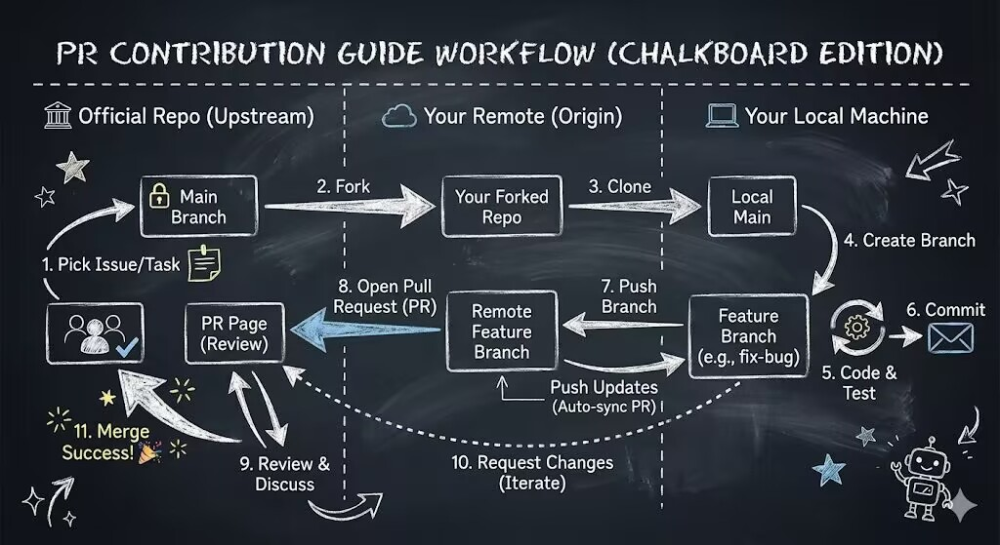

<div align="center">

# Matrix 群聊日常分析插件

[](https://github.com/AstrBotDevs/AstrBot)
[](LICENSE)

_✨ 一个基于 AstrBot 的智能群聊分析插件，能够生成精美的日常分析报告。专为 Matrix 平台适配。 ✨_

</div>

## 功能特色

### 🎯 智能分析
- **统计数据**: 全面的群聊活跃度和参与度统计
- **话题分析**: 使用 LLM 智能提取群聊中的热门话题和讨论要点
- **用户画像**: 基于聊天行为分析用户特征，分配个性化称号
- **圣经识别**: 自动筛选出群聊中的精彩发言

### 📊 可视化报告
- **多种格式**: 支持图片和文本输出格式
    - **精美图片**: 生成美观的可视化报告
    - **PDF 报告**: 生成专业的 PDF 格式分析报告（需配置）
- **详细数据**: 包含消息统计、时间分布、关键词、金句等

### 🛠️ 灵活配置
- **群组管理**: 支持指定特定群组启用功能
- **参数调节**: 可自定义分析天数、消息数量等参数
- **定时任务**: 支持设置每日自动分析时间
- **自定义 LLM 服务** ：支持自定义指定的 LLM 服务

## 配置选项

> [!NOTE]
> 以下配置情况仅供参考，请仔细阅读插件配置页面中各个字段的说明，以插件配置中的说明为准。

| 配置项 | 说明 | 备注 |
|--------|------|--------|
| 启用自动分析 | 启用定时触发自动分析功能需要按照插件配置里面的说明填写相关的需要的字段；简略说明：打开自动分析功能，在群聊列表中添加群号或者使用 `/分析设置 enable` 启用当前群聊 | 默认关闭，需要填写机器人 Matrix User ID (MXID) |
| PDF 格式的报告 | 初次使用需要使用 `/安装PDF` 命令安装依赖，首次使用命令安装，最后出现提示告诉你需要重启生效，是对的，需要重启 astrbot，而不是热重载插件。 | 输出格式需要设置为 PDF |
| 自定义 LLM 服务 | 插件配置中允许用户自行选取个人提供的 Astrbot 服务商列表中的大语言模型服务商 | 留空则回退到用户 Astrbot 现有服务商中第一个可用服务商 |

> [!IMPORTANT]
> **PDF 功能配置**：使用 `/安装PDF` 命令后，需要完全重启 AstrBot 才能生效，热重载插件无效！
> PDF 报告将自动保存在插件数据目录的 `reports` 文件夹中。

> [!TIP]
> **自定义 LLM 服务**：新版本弃用此前硬编码的 provider 提供方式，采用更符合 Astrbot 生态的更用户友好的配置方式，根据配置键选取 Provider，支持多级回退：
>    1. 尝试从配置获取指定的 provider_id（如 topic_provider_id）
>    2. 回退到主 LLM provider_id（llm_provider_id）
>    3. 回退到当前会话的 Provider（通过 umo）
>    4. 回退到第一个可用的 Provider

## 使用方法

### 基础命令

#### 群分析
```
/群分析 [天数]
```
- 分析群聊近期活动
- 天数可选，默认为 1 天
- 例如：`/群分析 3` 分析最近 3 天的群聊

#### 分析设置
```
/分析设置 [操作]
```
- `enable`: 为当前群启用分析功能
- `disable`: 为当前群禁用分析功能
- `status`: 查看当前群的启用状态
- 例如：`/分析设置 enable`

#### 模板设置
```
/查看模板
/设置模板 [模板名称或序号]
```
- `/查看模板`: 查看所有可用模板及预览图
- `/设置模板`: 查看当前模板和可用模板列表
- `/设置模板 [序号]`: 切换到指定序号的模板
- 例如：`/设置模板 1` 或 `/设置模板 scrapbook`

## 安装要求

> [!CAUTION]
> **必需条件**：
> - 已配置 LLM 提供商（用于智能分析）
> - Matrix 平台适配器 (astrbot_plugin_matrix_adapter)

## 注意事项

> [!WARNING]
> 1. **性能考虑**: 大量消息分析可能消耗较多 LLM tokens
> 2. **数据准确性**: 分析结果基于可获取的群聊记录，可能不完全准确
> 3. **图片发送**: Matrix 平台发送图片需要先上传，插件会自动处理，但需要网络畅通

## 贡献

### 贡献指南

<div align="center">



</div>

### 开发环境设置

为了保持代码质量，本项目使用 [pre-commit](https://pre-commit.com/) 钩子进行代码规范检查和自动修复。所有的贡献代码都必须通过 pre-commit 检查。

#### 1. 安装 pre-commit
```bash
pip install pre-commit
```

#### 2. 安装 git hook
在项目根目录下运行，这将确保在每次提交时自动运行检查：
```bash
pre-commit install
```

#### 3. 手动运行检查
如果需要手动触发所有文件的检查（推荐在提交前运行一次）：
```bash
pre-commit run --all-files
```

## 许可证

MIT License

欢迎提交 Issue 和 Pull Request 来改进这个插件！
